# Intro to TensorFlow For Deep Learning

[Udacity Course - Intro to TensorFlow For Deep Learning](https://learn.udacity.com/courses/ud187)

# What is ML?

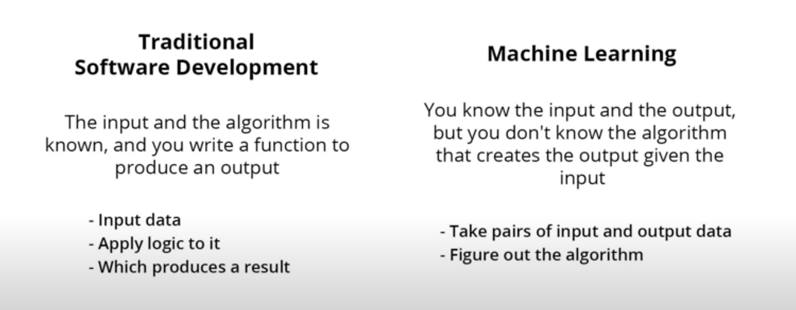

## Lab 1: From Celcius to Fahrenheit

```
l0 = tf.keras.layers.Dense(units=1, input_shape=[1]) 
model = tf.keras.Sequential([l0])
model.compile(loss='mean_squared_error', optimizer=tf.keras.optimizers.Adam(0.1))
history = model.fit(celsius_q, fahrenheit_a, epochs=500, verbose=False)
model.predict([100.0])
```

This example is the general plan for of any machine learning program. You will use the same structure to create and
train your neural network, and use it to make predictions.

### The Training Process

The training process (happening in model.fit(...)) is really about tuning the internal variables of the networks to the
best possible values, so that they can map the input to the output. This is achieved through an optimization process
called Gradient Descent, which uses Numeric Analysis to find the best possible values to the internal variables of the
model.

To do machine learning, you don't really need to understand these details. But for the curious: gradient descent
iteratively adjusts parameters, nudging them in the correct direction a bit at a time until they reach the best values.
In this case “best values” means that nudging them any more would make the model perform worse. The function that
measures how good or bad the model is during each iteration is called the “loss function”, and the goal of each nudge is
to “minimize the loss function.”

The training process starts with a forward pass, where the input data is fed to the neural network (see Fig.1). Then the
model applies its internal math on the input and internal variables to predict an answer ("Model Predicts a Value" in
Fig. 1).

In our example, the input was the degrees in Celsius, and the model predicted the corresponding degrees in Fahrenheit.

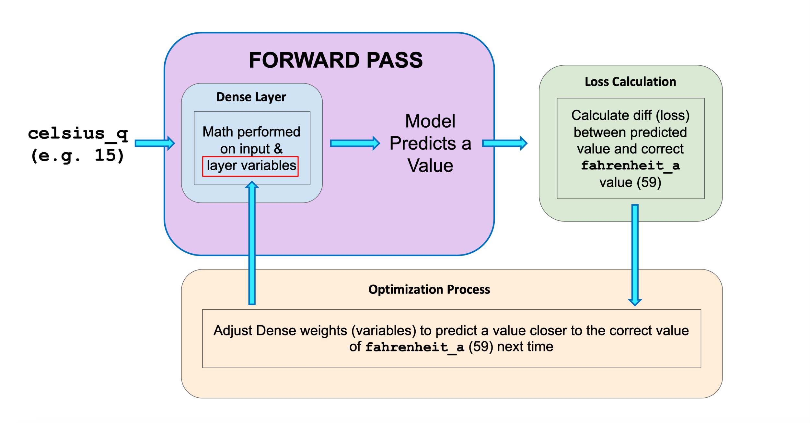

Once a value is predicted, the difference between that predicted value and the correct value is calculated. This
difference is called the loss, and it's a measure of how well the model performed the mapping task. The value of the
loss is calculated using a loss function, which we specified with the loss parameter when calling model.compile().

After the loss is calculated, the internal variables (weights and biases) of all the layers of the neural network are
adjusted, so as to minimize this loss — that is, to make the output value closer to the correct value (see Fig. 2).

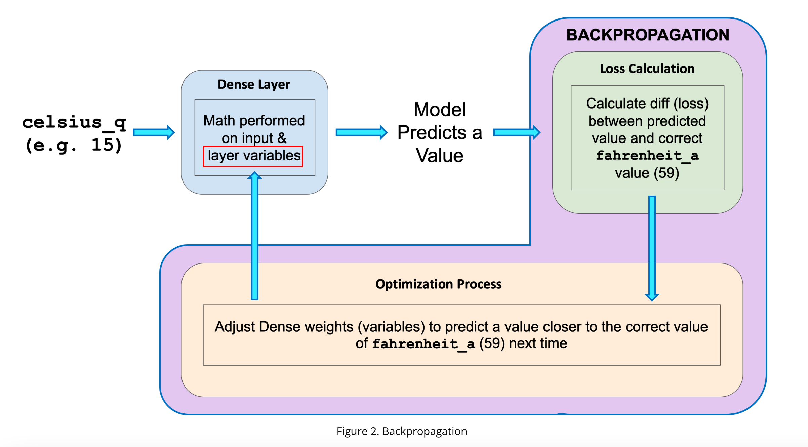
This optimization process is called Gradient Descent. The specific algorithm used to calculate the new value of each
internal variable is specified by the optimizer parameter when calling model.compile(...). In this example we used the
Adam optimizer.

[Reducing Loss](https://developers.google.com/machine-learning/crash-course/reducing-loss/video-lecture)

* Feature: The input(s) to our model
* Examples: An input/output pair used for training
* Labels: The output of the model
* Layer: A collection of nodes connected together within a neural network.
* Model: The representation of your neural network
* Dense and Fully Connected (FC): Each node in one layer is connected to each node in the previous layer.
* Weights and biases: The internal variables of model
* Loss: The discrepancy between the desired output and the actual output
* MSE: Mean squared error, a type of loss function that counts a small number of large discrepancies as worse than a
  large number of small ones.
* Gradient Descent: An algorithm that changes the internal variables a bit at a time to gradually reduce the loss
  function.
* Optimizer: A specific implementation of the gradient descent algorithm. (There are many algorithms for this. In this
  course we will only use the “Adam” Optimizer, which stands for ADAptive with Momentum. It is considered the
  best-practice optimizer.) A way of adjusting internal values in order to reduce the loss. 0.1 is the step size taken
  when adjusting the value.
  if the value is too small it will take too many iteration to train the model. Too large and accurecy goes down.
* Learning rate: The “step size” for loss improvement during gradient descent.
* Batch: The set of examples used during training of the neural network
* Epoch: A full pass over the entire training dataset. Specifies how many times this cycle should be run. i.e we have 7
  celsius and fahrenheit pairs with 500 epochs it makes total 3500 examples.
* Verbose -> controls how much output the method produces
* Forward pass: The computation of output values from input
* Backward pass (backpropagation): The calculation of internal variable adjustments according to the optimizer
  algorithm, starting from the output layer and working back through each layer to the input.

## Dense Layer

Every neuron in each layer is connected all the neuron in previous layer. These type of layers are fully connecte or
dence layers.
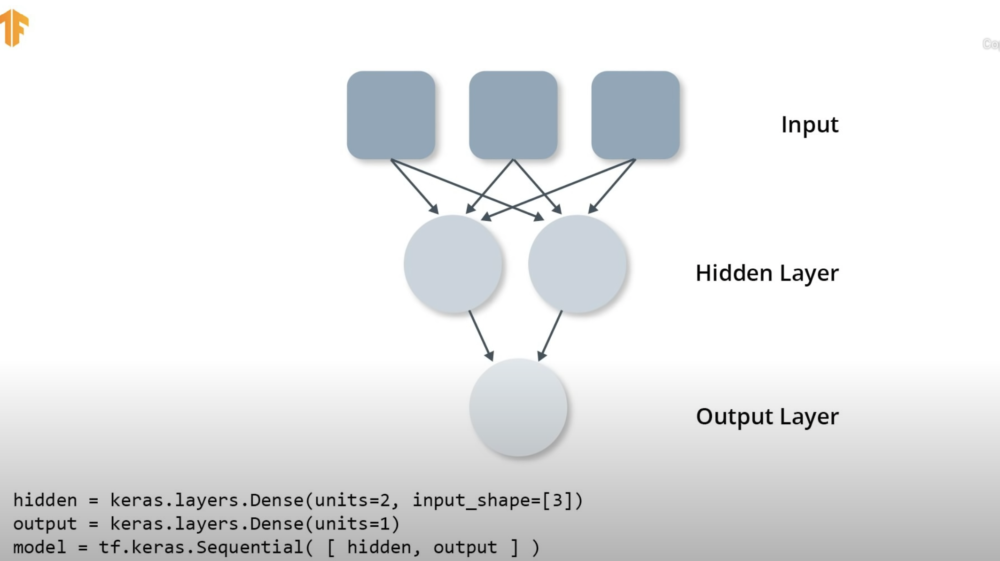

Calculation of the layers and output values (with weights W11, bias b1)
What happened in the training these weights and bias are best tuned during training oto the best possible values to be
able to match the inputs and the outputs.
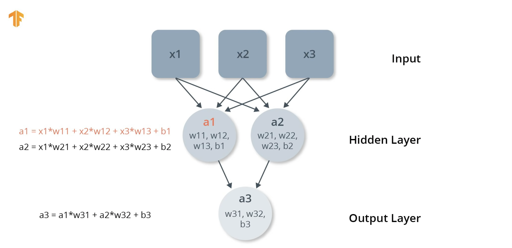

Lab 1 Celcius to Fahrenheit convertion.
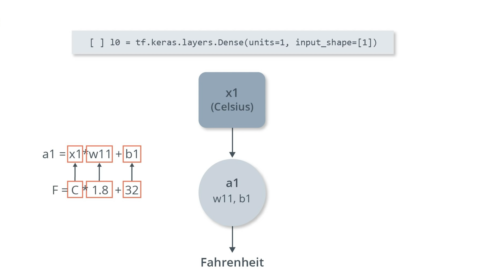

weight and bias of our model in lab 1
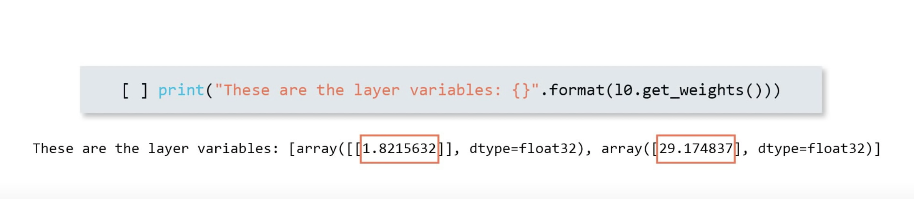

# First Model - Fashion MNIST

Fashion MNIST is an image data set which has 10 different type of clothes 28x28 pixels gray images in it.
Our neurol ntwork will be like here
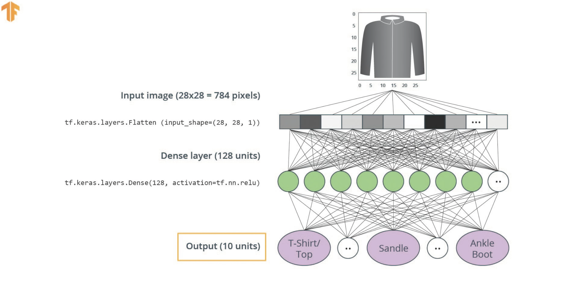

Converting 2D images to 28X28 = 784 pixel into vector is called **flattening**
This code will convert 28X28 2D array to 1D array 784 pixels.

```python
tf.keras.layers.Flatten(inout_shape(28, 28, 1))
```

for our dense layer we choose 128 units, with code:

```python
tf.keras.layers.Dense(units=128, activation=tf.nn.relu)
```

What is relu ? It is a mathematical function, which gives our dense layer more power. This will allow our model to solve
more complex models.

output 10 units are the confident of our model. this is the result and with %85 it is a shirt. These 10 numbers are
called **"probability distribution"** all sum up to 1.
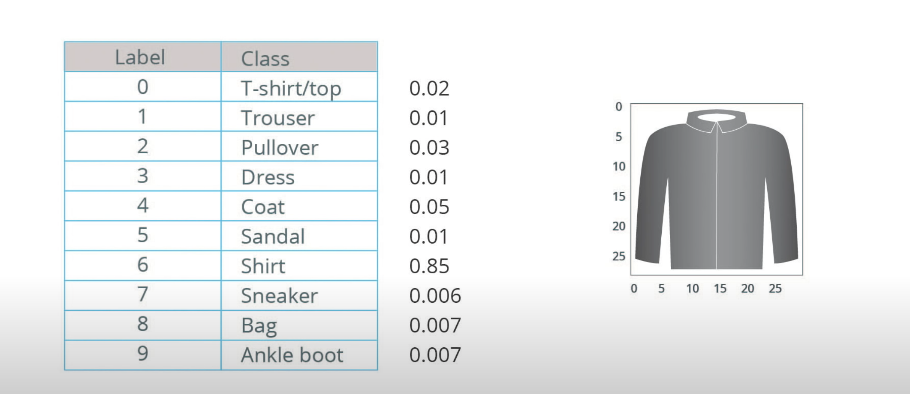

Now we need our output layer o create these 10 probability values for each of our classes.
**In fact, when ever we create a classification neural network, we always end neurol network with a dense layer that
contains same number of the labels with softmax statement.**
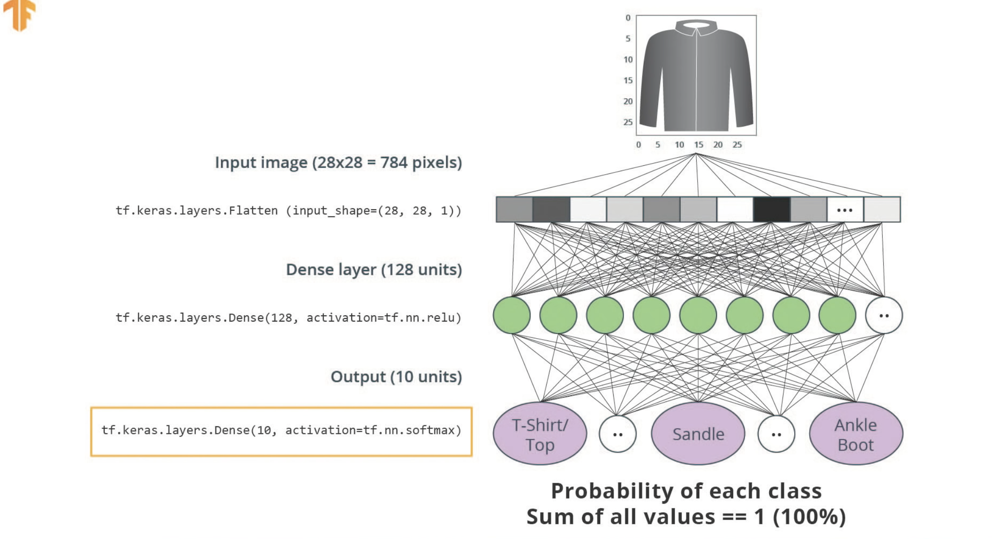

#### The Rectified Linear Unit (ReLU)

In this lesson we talked about ReLU and how it gives our Dense layer more power. ReLU stands for Rectified Linear Unit
and it is a mathematical function that looks like this:
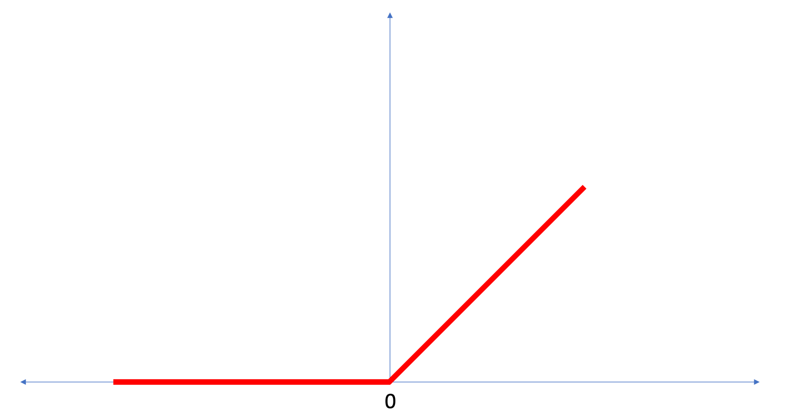
As we can see, the ReLU function gives an output of 0 if the input is negative or zero, and if input is positive, then
the output will be equal to the input.

**ReLU gives the network the ability to solve nonlinear problems.**

Converting Celsius to Fahrenheit is a linear problem because f = 1.8*c + 32 is the same form as the equation for a line,
y = m*x + b. But most problems we want to solve are nonlinear. In these cases, adding ReLU to our Dense layers can help
solve the problem.

ReLU is a type of activation function. There several of these functions (ReLU, Sigmoid, tanh, ELU), but ReLU is used
most commonly and serves as a good default. To build and use models that include ReLU, you don’t have to understand its
internals. But, if you want to know more, see this article
on [ReLU in Deep Learning](https://www.kaggle.com/dansbecker/rectified-linear-units-relu-in-deep-learning).

* Flattening: The process of converting a 2d image into 1d vector
* ReLU: An activation function that allows a model to solve nonlinear problems
* Softmax: A function that provides probabilities for each possible output class
* Classification: A machine learning model used for distinguishing among two or more output categories
