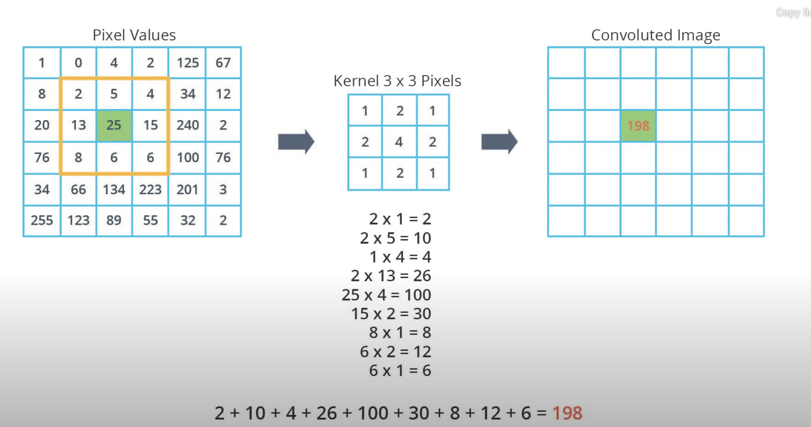

# Intro to TensorFlow For Deep Learning

[Udacity Course - Intro to TensorFlow For Deep Learning](https://learn.udacity.com/courses/ud187)

# What is ML?


## Lab 1: From Celcius to Fahrenheit

```
l0 = tf.keras.layers.Dense(units=1, input_shape=[1]) 
model = tf.keras.Sequential([l0])
model.compile(loss='mean_squared_error', optimizer=tf.keras.optimizers.Adam(0.1))
history = model.fit(celsius_q, fahrenheit_a, epochs=500, verbose=False)
model.predict([100.0])
```

This example is the general plan for of any machine learning program. You will use the same structure to create and
train your neural network, and use it to make predictions.

### The Training Process

The training process (happening in model.fit(...)) is really about tuning the internal variables of the networks to the
best possible values, so that they can map the input to the output. This is achieved through an optimization process
called Gradient Descent, which uses Numeric Analysis to find the best possible values to the internal variables of the
model.

To do machine learning, you don't really need to understand these details. But for the curious: gradient descent
iteratively adjusts parameters, nudging them in the correct direction a bit at a time until they reach the best values.
In this case “best values” means that nudging them any more would make the model perform worse. The function that
measures how good or bad the model is during each iteration is called the “loss function”, and the goal of each nudge is
to “minimize the loss function.”

The training process starts with a forward pass, where the input data is fed to the neural network (see Fig.1). Then the
model applies its internal math on the input and internal variables to predict an answer ("Model Predicts a Value" in
Fig. 1).

In our example, the input was the degrees in Celsius, and the model predicted the corresponding degrees in Fahrenheit.


Once a value is predicted, the difference between that predicted value and the correct value is calculated. This
difference is called the loss, and it's a measure of how well the model performed the mapping task. The value of the
loss is calculated using a loss function, which we specified with the loss parameter when calling model.compile().

After the loss is calculated, the internal variables (weights and biases) of all the layers of the neural network are
adjusted, so as to minimize this loss — that is, to make the output value closer to the correct value (see Fig. 2).


This optimization process is called Gradient Descent. The specific algorithm used to calculate the new value of each
internal variable is specified by the optimizer parameter when calling model.compile(...). In this example we used the
Adam optimizer.

[Reducing Loss](https://developers.google.com/machine-learning/crash-course/reducing-loss/video-lecture)

* Feature: The input(s) to our model
* Examples: An input/output pair used for training
* Labels: The output of the model
* Layer: A collection of nodes connected together within a neural network.
* Model: The representation of your neural network
* Dense and Fully Connected (FC): Each node in one layer is connected to each node in the previous layer.
* Weights and biases: The internal variables of model
* Loss: The discrepancy between the desired output and the actual output
* MSE: Mean squared error, a type of loss function that counts a small number of large discrepancies as worse than a
  large number of small ones.
* Gradient Descent: An algorithm that changes the internal variables a bit at a time to gradually reduce the loss
  function.
* Optimizer: A specific implementation of the gradient descent algorithm. (There are many algorithms for this. In this
  course we will only use the “Adam” Optimizer, which stands for ADAptive with Momentum. It is considered the
  best-practice optimizer.) A way of adjusting internal values in order to reduce the loss. 0.1 is the step size taken
  when adjusting the value.
  if the value is too small it will take too many iteration to train the model. Too large and accurecy goes down.
* Learning rate: The “step size” for loss improvement during gradient descent.
* Batch: The set of examples used during training of the neural network
* Epoch: A full pass over the entire training dataset. Specifies how many times this cycle should be run. i.e we have 7
  celsius and fahrenheit pairs with 500 epochs it makes total 3500 examples.
* Verbose -> controls how much output the method produces
* Forward pass: The computation of output values from input
* Backward pass (backpropagation): The calculation of internal variable adjustments according to the optimizer
  algorithm, starting from the output layer and working back through each layer to the input.

## Dense Layer

Every neuron in each layer is connected all the neuron in previous layer. These type of layers are fully connecte or
dence layers.


Calculation of the layers and output values (with weights W11, bias b1)
What happened in the training these weights and bias are best tuned during training oto the best possible values to be
able to match the inputs and the outputs.


Lab 1 Celcius to Fahrenheit convertion.


weight and bias of our model in lab 1


# First Model - Fashion MNIST

Fashion MNIST is an image data set which has 10 different type of clothes 28x28 pixels gray images in it.
Our neurol ntwork will be like here


Converting 2D images to 28X28 = 784 pixel into vector is called **flattening**
This code will convert 28X28 2D array to 1D array 784 pixels.

```python
tf.keras.layers.Flatten(inout_shape(28, 28, 1))
```

for our dense layer we choose 128 units, with code:

```python
tf.keras.layers.Dense(units=128, activation=tf.nn.relu)
```

What is relu ? It is a mathematical function, which gives our dense layer more power. This will allow our model to solve
more complex models.

output 10 units are the confident of our model. this is the result and with %85 it is a shirt. These 10 numbers are
called **"probability distribution"** all sum up to 1.


Now we need our output layer o create these 10 probability values for each of our classes.
**In fact, when ever we create a classification neural network, we always end neurol network with a dense layer that
contains same number of the labels with softmax statement.**


#### The Rectified Linear Unit (ReLU)

In this lesson we talked about ReLU and how it gives our Dense layer more power. ReLU stands for Rectified Linear Unit
and it is a mathematical function that looks like this:

As we can see, the ReLU function gives an output of 0 if the input is negative or zero, and if input is positive, then
the output will be equal to the input.

**ReLU gives the network the ability to solve nonlinear problems.**

Converting Celsius to Fahrenheit is a linear problem because f = 1.8*c + 32 is the same form as the equation for a line,
y = m*x + b. But most problems we want to solve are nonlinear. In these cases, adding ReLU to our Dense layers can help
solve the problem.

ReLU is a type of activation function. There several of these functions (ReLU, Sigmoid, tanh, ELU), but ReLU is used
most commonly and serves as a good default. To build and use models that include ReLU, you don’t have to understand its
internals. But, if you want to know more, see this article
on [ReLU in Deep Learning](https://www.kaggle.com/dansbecker/rectified-linear-units-relu-in-deep-learning).

* Flattening: The process of converting a 2d image into 1d vector
* ReLU: An activation function that allows a model to solve nonlinear problems
* Softmax: A function that provides probabilities for each possible output class
* Classification: A machine learning model used for distinguishing among two or more output categories

## Training and Testing

Datasets are typically split into different subsets to be used at various stages of training and evaluation of the
neural network. In this section we talked about:

Training Set: The data used for training the neural network.
Test set: The data used for testing the final performance of our neural network.
The test dataset was used to try the network on data it has never seen before. This enables us to see how the model
generalizes beyond what it has seen during training, and that it has not simply memorized the training examples.

In the same way, it is common to use what is called a Validation dataset. This dataset is not used for training.
Instead, it it used to test the model during training. This is done after some set number of training steps, and gives
us an indication of how the training is progressing. For example, if the loss is being reduced during training, but
accuracy deteriorates on the validation set, that is an indication that the model is memorizing the test set.

The validation set is used again when training is complete to measure the final accuracy of the model.

You can read more about all this in the Training and Test Sets lesson
of [Google’s Machine Learning Crash Course](https://developers.google.com/machine-learning/crash-course/training-and-test-sets/video-lecture)
.

2 different labs here:


### Summary

In this lesson we trained a neural network to classify images of articles of clothing. To do this we used the Fashion
MNIST dataset, which contains 70,000 greyscale images of articles of clothing. We used 60,000 of them to train our
network and 10,000 of them to test its performance. In order to feed these images into our neural network we had to
flatten the 28 × 28 images into 1d vectors with 784 elements. Our network consisted of a fully connected layer with 128
units (neurons) and an output layer with 10 units, corresponding to the 10 output labels. These 10 outputs represent
probabilities for each class. The softmax activation function calculated the probability distribution.

We also learned about the differences between regression and classification problems.

* **Regression**: A model that outputs a single value. For example, an estimate of a house’s value.
* **Classification**: A model that outputs a probability distribution across several categories. For example, in Fashion
  MNIST, the output was 10 probabilities, one for each of the different types of clothing. Remember, we use Softmax as
  the activation function in our last Dense layer to create this probability distribution.

# Intro to CNN (Convolutional Neurol Network)

There are 2 main concepts
1- Convolutions
2- Max-pooling

## Convolutions

Convolutional is a useful technique. Kernel convolution is just this process of applying the kernel or filter across
different areas of the input image.

Imagine there is a gray scale image which is 2D scale with pixels. And image has values from 0-255.


The idea of convolutional layer is to create another grid of numbers called the kernel or filter, which can be seen here
3x3 matrix, then we scan kernel across the image.

Then we add the kernel to out grid like below:


What will happen into the corner matrix pixels?
There are some solutions.

1. Not to use those pixels in convolutions, just ignore pretend like no exist. Downside you will lose information.
2. Add zero-padding around the matrix.  
   

## Max-pooling

It is a process reducing the size of an input image by summarising regions.
We select from convolutioned matrix the greatest value in the orange 2x2 pixel and add into new image matrix.
Stride : determines the number of the pixels to slide the window across the image. in this example stride is 2. That's
mean we will slide the our orange grid 2 pixels to right.

We downsampled the original image to the new image. The new image is depending on the grid size and the strike we
chosed.

## Recap

We just learned about convolutions and max pooling.

A convolution is the process of applying a filter (“kernel”) to an image. Max pooling is the process of reducing the
size of the image through downsampling.

As you will see in the following Colab notebook, convolutional layers can be added to the neural network model using the
Conv2D layer type in Keras. This layer is similar to the Dense layer, and has weights and biases that need to be tuned
to the right values. The Conv2D layer also has kernels (filters) whose values need to be tuned as well. So, in a Conv2D
layer the values inside the filter matrix are the variables that get tuned in order to produce the right output.

Here are some of terms that were introduced in this lesson:

* CNNs: Convolutional neural network. That is, a network which has at least one convolutional layer. A typical CNN also
  includes other types of layers, such as pooling layers and dense layers.
* Convolution: The process of applying a kernel (filter) to an image
* Kernel / filter: A matrix which is smaller than the input, used to transform the input into chunks
* Padding: Adding pixels of some value, usually 0, around the input image
* Pooling The process of reducing the size of an image through downsampling.There are several types of pooling layers.
  For example, average pooling converts many values into a single value by taking the average. However, maxpooling is
  the most common.
* Maxpooling: A pooling process in which many values are converted into a single value by taking the maximum value from
  among them.
* Stride: the number of pixels to slide the kernel (filter) across the image.
* Downsampling: The act of reducing the size of an image

**Note: Sometimes train accurancy > test data. One of the reason can be we use big epocs and model can overfitted data
and
memorise the training data. When it comes to test data it can see some images first time thats why accurency can be
lower.**

[A Comprehensive Guide to Convolutional Neural Networks — the ELI5 way](https://towardsdatascience.com/a-comprehensive-guide-to-convolutional-neural-networks-the-eli5-way-3bd2b1164a53)

# Time Series Forecasting

* missing data in time-series calls imputation
* Sometimes series are just completely unpredictable.
    * The best you can do this is the to identify the probability distribution and find its parameters.
* 

## Forecasting

* how do you measure the performance of forcasting?
    * Fixed partitioning: You can split time series into training, validation and test periods.
    * If the time series has some sesionality, you should include those periods, like if time series has yearly
      seasonality, we should partition by years.
    * You train your model in train period and evaluate on validation period.
    * You can iterate to find the right architecture and tune it's hyper params unit you reach the desired performance n
      the validation period.
    * One last tieme you can train your model Train + validation period once and then evaluate in test period.
    * And you shoul d train your model once last time including your test period before deploy your model to production.
    * [](./media/24.png)
* Role Forward Partitioning
    * You start with a short training period and graduatelly increase the period by one day/week at a time and each
      iteration will train the model and we forecast following day/week in validation period.
    * Negative: Require more training time
    * Positive : closely mimic the production conditions.
    * [](./media/25.png)

## Metics

* to evaluate forecasting performance we need some metrics. Some of them errors.
* [](./media/26.png)
* Lets look at Naive Forecast Mae value. This is our baseline
* [](./media/27.png)

* **Moving Average:**
    * Another simple forecasting model is to compute moving average
    * This is the mean of past N values. F.e. mean value over the last 30 days
    * This eliminates the noice in series , but does not anticipate with trend or seasionality.
    * But ends up worse than naive forecasting.
    * [](./media/28.png)

* One way to fix this, remove trend or seasionality from time series. For this we use **Differencing** technique
* Here we work on difference between now and one year early, which does not have trends and seasionality.
* Then we can work moving average on this.
* [](./media/29.png)
* [](./media/30.png)
* But this wont give the poriginal time series forecast, at the end we should add value t-(t-365) value back the
  forecasted value.
* And result will be like this:
* [](./media/31.png)
* We can remove the past noises from Moving Average like here and better results
* [](./media/32.png)