# Time Series Forecasting

Udacity Course : https://learn.udacity.com/courses/ud980

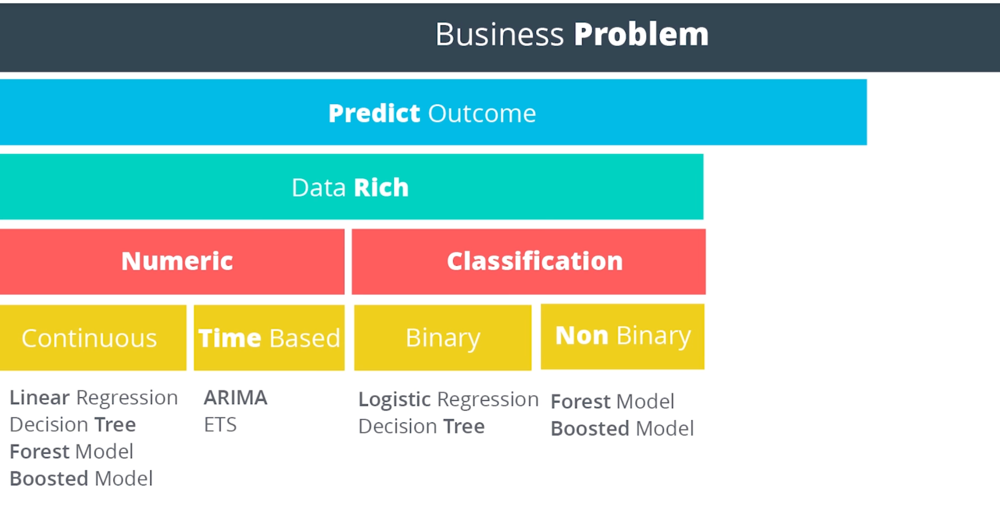

# Basics:

## Trend:

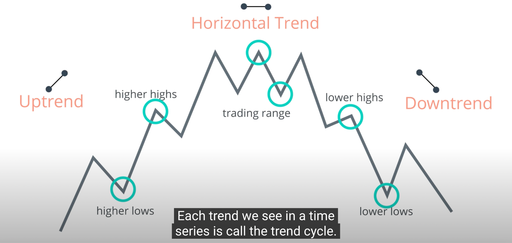

## Seasional Plot:

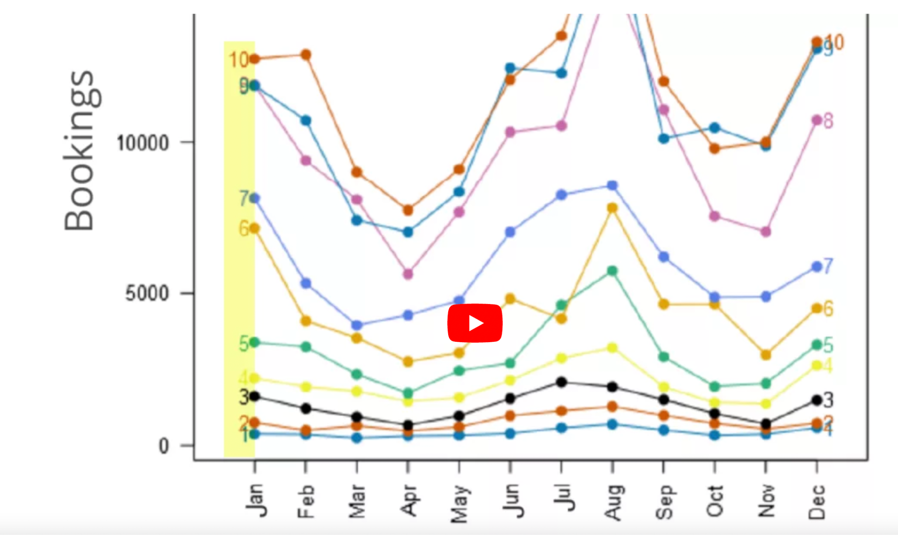

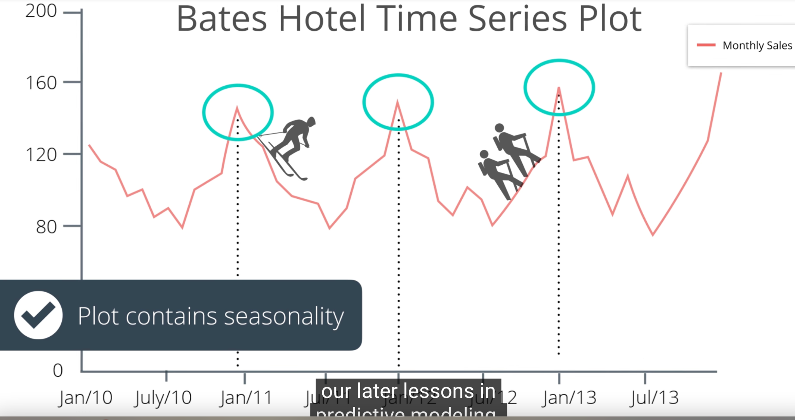

Here is a seasonal pattern, which can show that there is a repeated
pattern for the same time ranges.

And also when we look at magnitudes of ech year sales are getting
bigger, that's mean there is a uptrend of sales.

## Cyclical pattern:

What if we see a pattern in our data , which is not occurred with in the
same calender year? This is cyclical pattern exist when there is a rises
and falls that are not f a fixed period.

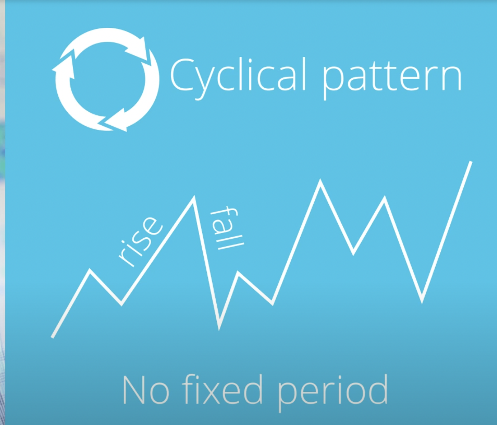

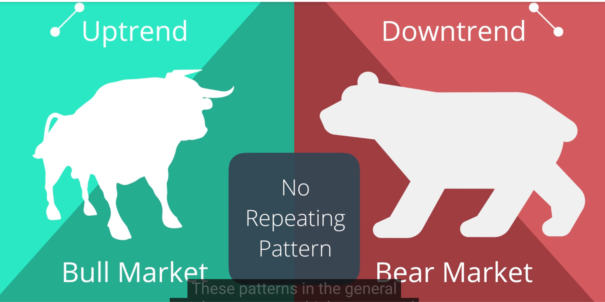

**If fluctuations are not a fixed period then they are cyclical.**

**If the period is unchanging and associated within some aspect of
calender it is seasonal.**

# ETS Model:

## Exponantel Smoothing Forcasting Model:

This model uses weighted averages past observations and giving more
weight to the most present observation and with weights gradually
getting smaller in the past observations.


## ETS:

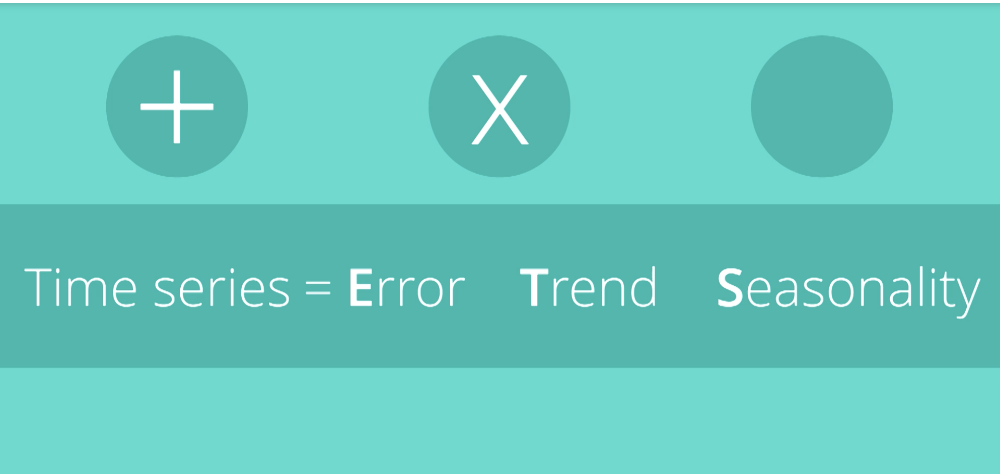

Each term can apply other additively, multiplicative or in some cases
lefts out of the model all together.

How to apply Error Trend and Seasonal terms of an ETS model (Error Trend
Seasonal) it is a way to apply Time Series Decomposition plot.

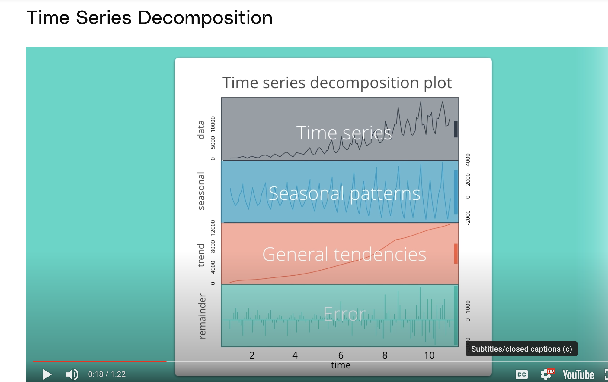

**Data** shows the actual time series data

**The seasonal** shows that there are a seasonal patterns e can see in
in Hotel booking example, seasonal only occurs regular intervals and th
increasing magnitude

**Trend line** indicates the general core or tendency of time series.
It is the centered moving average of the time series and fits between
seasonal aks and valleys. This line considered de Seasonalized

**Error**: Difference between observed value and endline estimate. It is
the piece that non accounted for combining seasonal piece and trend
piece. All time series have the residual errors help explain with trend
and seasonality can not.

Making use of the trend seasonal and error plots shown together Time
series Decomposition Plot.

## Identifying Additive or Multiplicative Terms

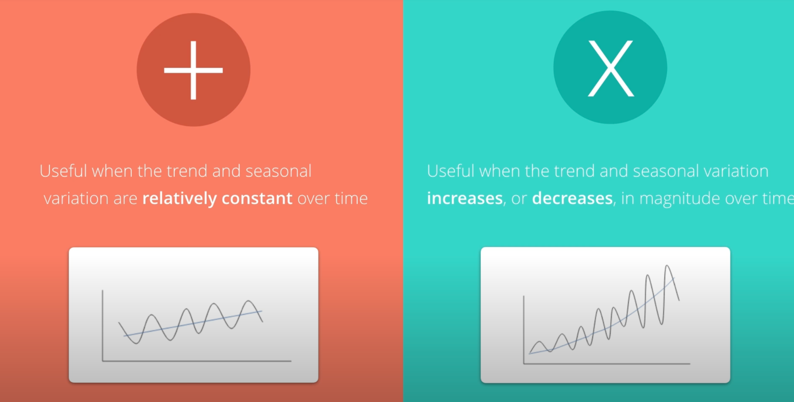

behaviour

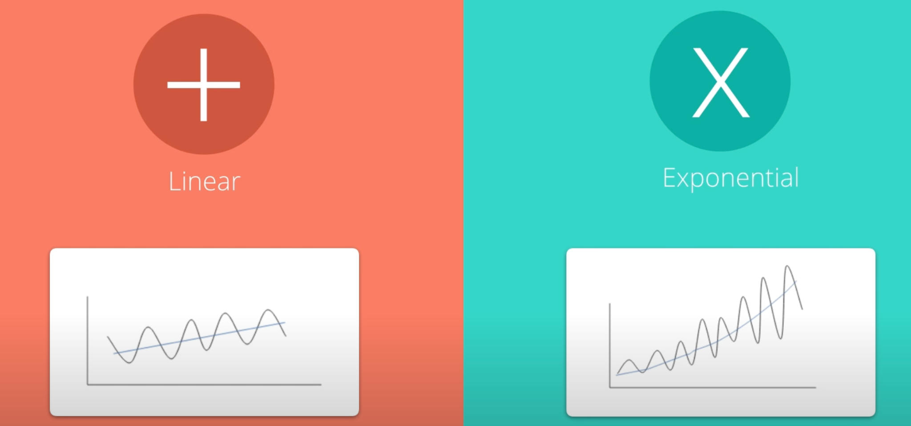

Selecting additive or Multiplicative behaviour in terms of relies on
analysis's ability to seen, seasonal and error patterns.

## Time Series Scenarios

Next we're going to be exploring several exponential models
to understand how each model is different and which model should be used
for which specific scenario you'll see in a time series. The possible
time series (TS) scenarios can be recognized by asking the following
questions:

- TS has a trend?

    - If yes, is the trend increasing linearly or exponentially?

- TS has seasonality?

    - If yes, do the seasonal components increase in magnitude over
      > time?

### Scenarios

Therefore the scenarios could be:

- No-Trend, No-Seasonal

- No-Trend, Seasonal-Constant

- No-Trend, Seasonal-Increasing

```{=html}
<!-- -->
```

- Trend-Linear,No-Seasonal

- Trend-Linear,Seasonal-Constant

- Trend-Linear,Seasonal-Increasing

```{=html}
<!-- -->
```

- Trend-Exponential,No-Seasonal

- Trend-Exponential,Seasonal-Constant

- Trend-Exponential,Seasonal-Increasing

As you can see there are nine possible scenarios.

### ETS Models

We are going to explore four ETS models that can help forecast these
possible time-series scenarios.

- Simple Exponential Smoothing Method

- Holt's Linear Trend Method

- Exponential Trend Method

- Holt-Winters Seasonal Method

# Simple Exponential Smoothing


Time series does not have a trend line and does not have seasonality
component. We would use a Simple Exponential Smoothing model.

For simple exponential smoothing methods, the forecast is calculated by
multiplying past values by relative weights, which are calculated based
upon what is termed a smoothing parameter. You'll also hear this called
the alpha or **α**. This is the magnitude of the weight applied to the
previous values, with the weights decreasing exponentially as the
observations get older. The formula looks like this:

Forecast = Weightt Yt + Weightt-1 Yt-1 + Weightt-2 Yt-2 + \... + (1-α)n
Yn

where

**t** is the number of time periods before the most recent period (e.g.
**t** = 0 for the most recent time period, **t** = 1 for the time period
before that).

**Yt** = actual value of the time series in period t

**Weightt** = α(1-α)t

**n** = the total number of time periods

This model basically gives us a smooth line or **LEVEL** in our forecast
that we can use to forecast the next period.

Here are a few key points to help understand the smoothing parameter:

- The smoothing parameter can be set for *any value between 0 and 1*.

- If the smoothing parameter is close to one, more recent observations
  carry more weight or influence over the forecast (if **α** = 0.8, weights are 0.8, 0.16, 0.03, 0.01, etc.).

- If the smoothing parameter is close to zero, the influence or weight
  of recent and older observations is more balanced (if **α** = 0.2, weights are 0.2, 0.16, 0.13, 0.10, etc.).

#### **Choosing the Smoothing Parameter α**

Choosing the correct smoothing parameter is often an iterative process.
Luckily, advanced statistical tools, like Alteryx, will select the best
smoothing parameter based upon minimizing forecasting error. Otherwise,
you will need to test many smoothing parameters against each other to
see which model best fits the data.

The advantage of exponential smoothing methods over simple moving
averages is that new data is depreciated at a constant rate, gradually
declining in its impact, whereas the impact of a large or small value in
a moving average, will have a constant impact. **However, this also means
that exponential smoothing methods are more sensitive to sudden large or
small values.**

**The simple exponential smoothing method does not account for any trend
or seasonal components, rather, it only uses the decreasing weights to
forecast future results. This makes the method suitable only for time
series without trend and seasonality.**

[[https://otexts.com/fpp2/ses.html]{.underline}](https://otexts.com/fpp2/ses.html)

[[https://www.excel-easy.com/examples/exponential-smoothing.html]{.underline}](https://www.excel-easy.com/examples/exponential-smoothing.html)

# Holt's Linear Trend Method (Double Exponaential Smoothing )

The method builds off of a simple exponential smooting by including not
only the level but also the trend in its calculation.

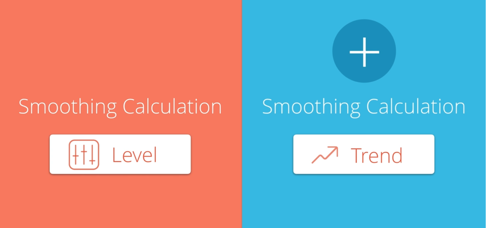

it calculates level and trend smoothing calculation. It always applied
in a linear or additive fashion.

**Holts linear model is a great model to apply to any non-seasonal data
set.**

# Exponential Trend Method

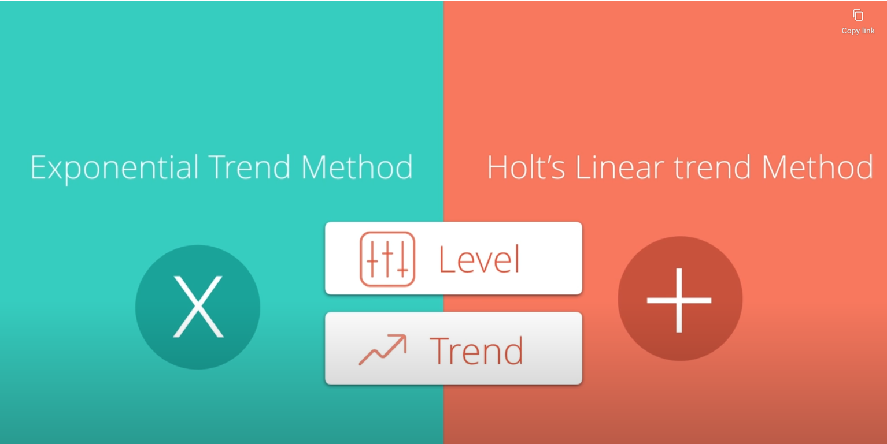

A variation of the holts linear trend method is Exponential Trend Method,
it is uses Level and trend components but it multiplies them. This means
trend will de/increase exponential rather that linear and exhibits
forecasts with a trend growth rate by factoring rather than additional.

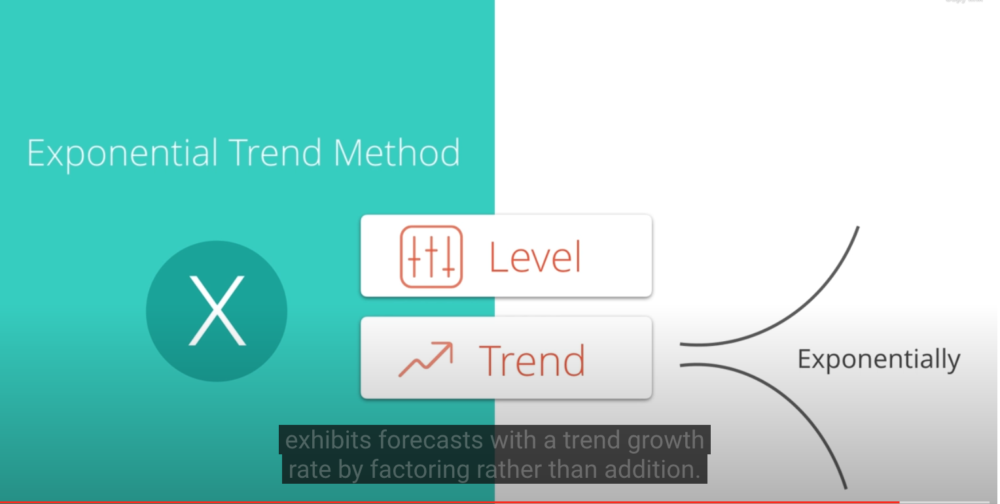

# Damped Trend Method

Sometimes our model can over forecast results since the forecast
generated display a constant trend line extrapolating values into the
future.

Damped Trend methods can apply additively and multiplicative fashion.

Small phi(𝚽) mean trend line changes overtime is slow. Larger phi means
changing rapidly.

# Holt-Winter Seasonal Method

Holtz-Winter Seasonal method comprises of forecast equation with 3
smoothing equations, Level, Trend and Seasional. We can 2 variations of
applications additive and multiplicative .

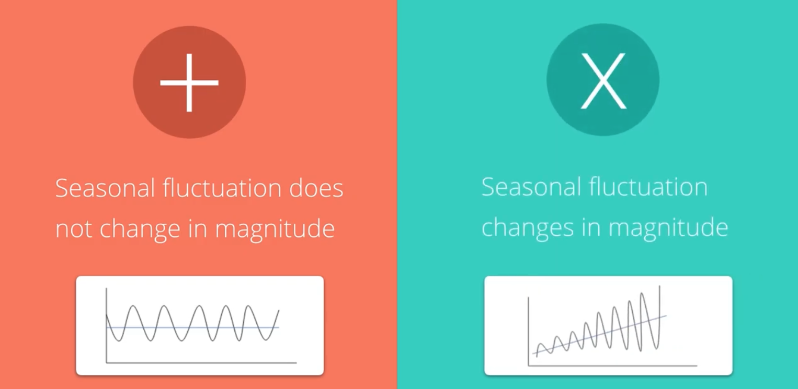

Holtz-Winter can also use with a damped parameter, and is one of the
most widely regarded methods for forecasting seasonal data.

# Overview

What You've Learned So Far
Let's take a step back and understand what we've learned so far.

## Methods

There are several methods we need to pick in order to model any given time series appropriately:

* Simple Exponential Smoothing
    * Finds the level of the time series
* Holt's Linear Trend
    * Finds the level of the time series
    * Additive model for linear trend
* Exponential Trend
    * Finds the level of the time series
    * Multiplicative model for exponential trend
* Holt-Winters Seasonal
    * Finds the level of the time series
    * Additive for trend
    * Multiplicative and Additive for seasonal components

These methods help deal with different scenarios in our time series involving:

* Linear or exponential trend
* Constant or increasing seasonality components

For trends that are exponential, we would need to use a **multiplicative** model.

For increasing seasonality components, we would need to use a **multiplicative** model model as well.

## ETS

Therefore we can generalize all of these models using a naming system for ETS:

**ETS (Error, Trend, Seasonality)**
Error is the error line we saw in the time series decomposition part earlier in the course. If the error is increasing
similar to an increasing seasonal components, we would need to consider a multiplicative design for the exponential
model.

Therefore, for each component in the ETS system, we can assign None, Multiplicative, or Additive (or N, M, A) for each
of the three components in our time series.

Examples:
A time series model that has a constant error, linear trend, and increasing seasonal components' means we would need to
use an ETS model of:

* ETS(A,A,M)

A time series model that has increasing error, exponential trend, and no seasonality means we would need to use an ETS
model of:

* ETS(M,M,N)

# ETS Models

ETS models are designed to forecast time series data by observing the trend and seasonality patterns in
a time series, and projecting those trends into the future.

## STEP 1: TIME SERIES DECOMPOSITION PLOT

A time series decomposition plot allows you to observe the seasonality, trend, and error/remainder terms of a time
series.
Useful Alteryx Tool: TS Plot

## STEP 2: DETERMINE ERROR, TREND, AND SEASONALITY

An ETS model has three main components: error, trend, and seasonality. Each can be applied either
additively, multiplicatively, or not at all.

* Trend - If the trend plot is linear then we apply it additively (A). If the trend line grows or shrinks exponentially,
  we apply it multiplicatively (M). If there is no clear trend, no trend component is included
  (N).
* Seasonal - If the peaks and valleys for seasonality are constant over time, we apply it additively (A). If the size of
  the seasonal fluctuations tends to increase or decrease with the level of time series, we apply it multiplicatively (
  M). If there is no seasonality, it is not applied (N).
* Error - If the error plot has constant variance over time (peaks and valleys are about the same size), we apply it
  additively (A). If the error plot is fluctuating between large and small errors over time, we apply it
  multiplicatively (M).
  Useful Alteryx Tool: TS Plot

## STEP 3: BUILD AND VALIDATE THE ETS MODEL

Build the ETS model using the components determined in step 2. You can use internal and external
validation to validate the quality of the model.

* Internal validation: Look at in-sample error measures, particularly RMSE (Root-Mean-Square Error) and
  MASE (Mean Absolute Scaled Error).
* External validation: Determine the accuracy measures by comparing the forecasted values with the
  holdout sample. This is especially important for comparing ETS models to other types of models, such as
  ARIMA.

Pick the ETS model with lowest AIC value. If the AIC values are comparable, use calculated errors to pick one that
minimizes error the most. Many software tools will automate the selection of the model by
minimizing AIC.

Useful Alteryx Tools: ETS, TS Compare

## STEP 4: FORECAST!

Use the best ETS model to forecast for the desired time period. Make sure to add the holdout sample
back into the model. Plot the results along with 80% and 95% confidence intervals.
Useful Alteryx Tool: TS Forecast

# Introduction to ARIMA Models (Auto Regressive Integrated Moving Average)

An autoregressive integrated moving average, or ARIMA, is a statistical analysis model that uses time series data to
either better understand the data set or to predict future trends.

There are two types ARIMA models:

* Seasonal
* Non-seasonal

## Non- Seasonal


(p,d,q) represents the amounth of periods for in ARIMA calculation.
p-2 means , we will use 2 previouss periods of our time series in the autoregressive portions of the calculation. This
helps to adjust the line fitted to forecast the series.
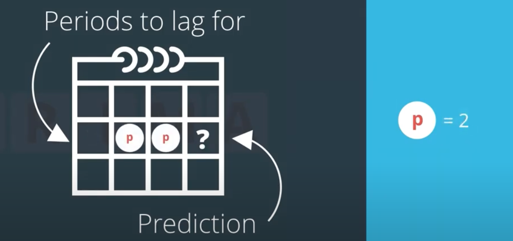

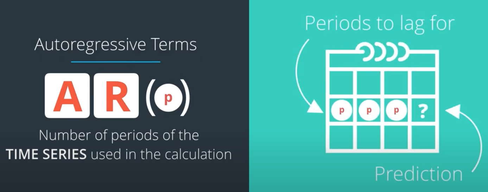

The differencing term refers to the process we use to transform a time series into a stationary one. (That is a series
without trend or Seasonality). This process clled differencing and d refers to the number of transformations used in the
process.
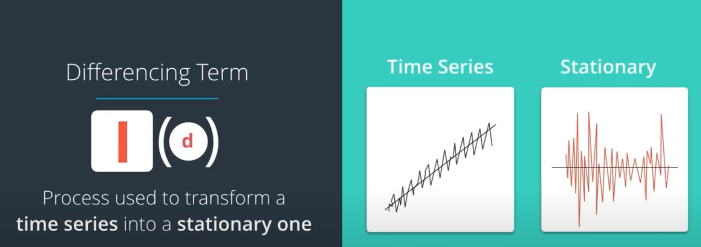

Moving Average term refers to the lag of the error component. Error component refers to the part of the time series not
explained by trend or seasonality. MA looks lie linear regression models where the predictive variables are the previous
q periods of errors.
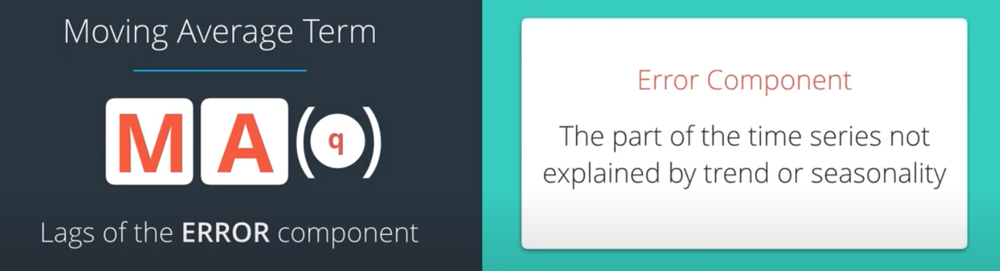

[ARIMA Overview](https://www.investopedia.com/terms/a/autoregressive-integrated-moving-average-arima.asp)

## Stationarity

Time Series may need to be transformed by differencing to be made stationary. Why?
Stationary means , mean and variance are constant over time. ARIMA models are making adjustments and calculations over
time to make the series stationary.
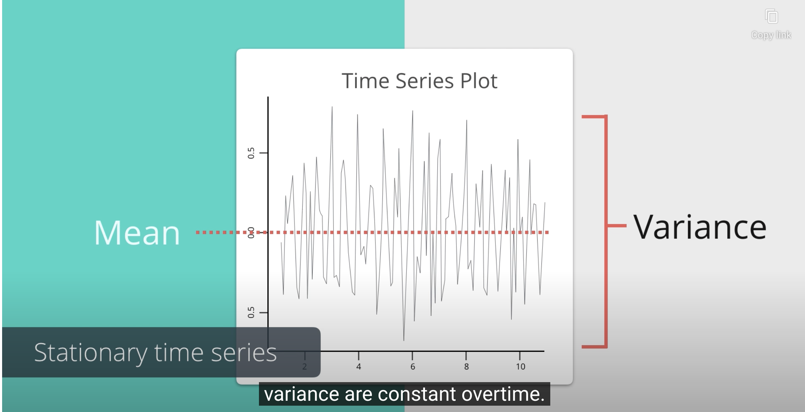
A stationary series are relatively easy to predict for our models, it simply predicts that its mean and variance will ve
the same in future as they in the past.
A stationary time series will also allow us to obtain meaningful statistics such as means variances and correlations
with other variables.
This statistics are only useful descriptors if the series are stationary.

## Differencing

Differencing is a method of transforming a non-stationary time series to a stationary one. This is an important step in
preparing data to be used in an ARIMA model.
The number of times of differencing needed to render the series stationary will be the differenced I(d) term in our
ARIMA model.
The best way to determine whether or not the series is sufficiently differenced is to plot the differenced series and
check to see if there is a constant mean and variance.

## Autocorrelation Function Plot (ACF)

In order to construct an ARIMA model, it is important to understand whether and to what degree authocorrelation exist in
the time series.
**Autocorrelation** refers to how correlate the time series is with its past values.
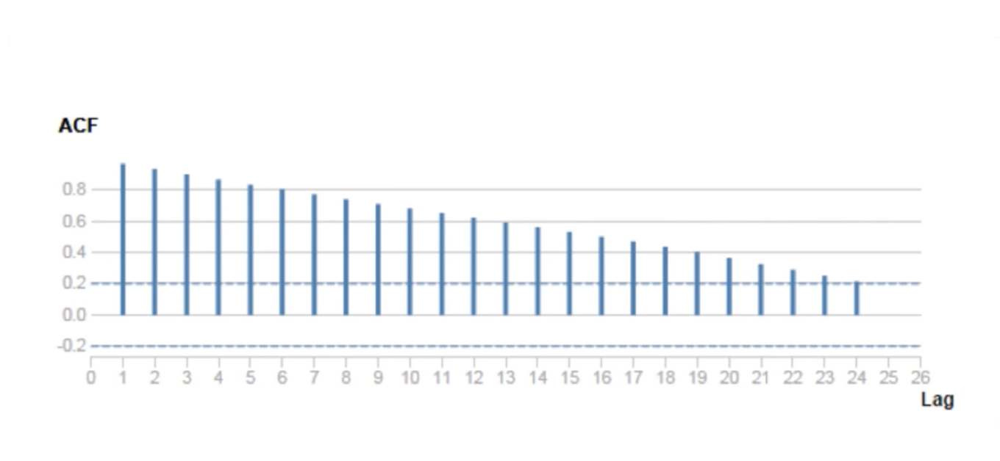

ACF used to see the correlation between the points up to, and including our lag unit.
vertical axis: Correlation Coefficient.
horizontal axis: number of Lag. How far our time series correlated with itself.

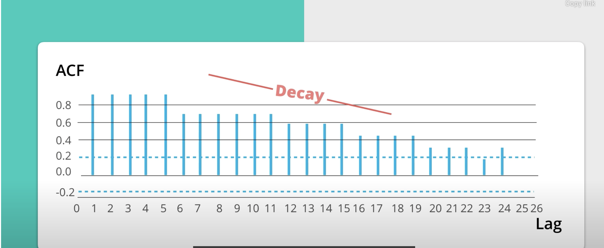
This has slow decay towards 0 correlation. Meaning current values are more related with the recent values than the
values further in the past.
This suggests that series is non-stationary and need to be differenced to reach stationary.

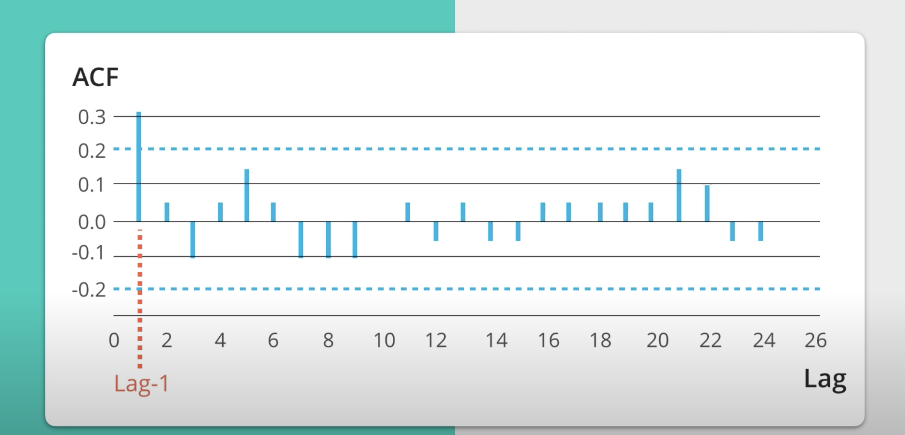
This ACF plot is taken with first differenced values. you can see after Lag-1 the significance is much less, suggesting
now it is stationary series.

This plot help us to use AR ot MA terms or both components. Both terms used component models are less.
**Selecting Models:**
if stationary series has positive correlation at Lag-1 it as AR terms suggested, if it is negative correlation in Lag-1
then MA terms suggesting.

In our example Lag-1 is positive then we will use AR model.
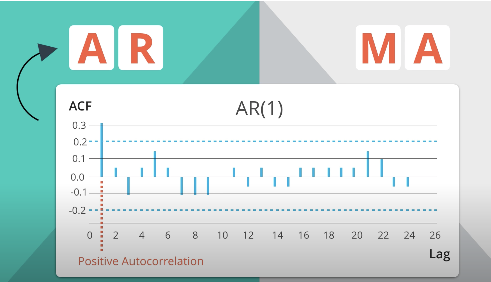

## Partial Autocorrelation Function Plot (PACF)

[A Gentle Introduction to Autocorrelation and Partial Autocorrelation](https://machinelearningmastery.com/gentle-introduction-autocorrelation-partial-autocorrelation/#:~:text=A%20partial%20autocorrelation%20is%20a,relationships%20of%20intervening%20observations%20removed.)
[Partial Autocorrelation Function (PACF)](https://online.stat.psu.edu/stat510/lesson/2/2.2)
**Partial Correlation :** The correlation between 2 variables controlling for the values of another set of variables.
ACF calculates the correlation each of the previous points with the value, The PACF shows correlation of those points,
controlling for the values of all previous lag variables.


Inspecting PACF will suggest how many AR term you need to use to explain the autocorrelation pattern between in a time
series.
If the PACF drops off at a lag of k. It generally indicates the ARk model. If drops off gradually, it suggest a MS
model.

In this example PACF drops in lag-1 which fits our AR(1) model.
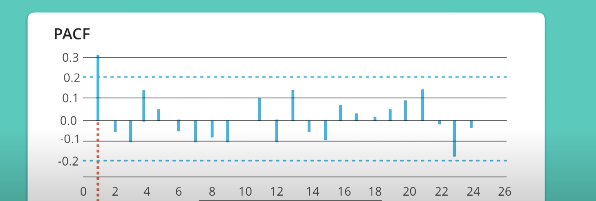

## Summery:

Which model is usefull:
AR model:

* If ACF shows autocorrelation by decaying to 0 while PACF cuts off quickly to 0 in lag-1, and stationary data (after
  differenciated) has positive in lag-1. AR(1) is suitable
  MA model:
* If ACF is negative auto correlated at lag-1 and ACF cut sharply a few lags, and a PACF that decreases out more
  gradualtely, MA model suits best.

[Identifying the numbers of AR or MA terms in an ARIMA model](https://people.duke.edu/~rnau/411arim3.htm)

* Rule 6: If the PACF of the differenced series displays a sharp cutoff and/or the lag-1 autocorrelation is
  positive--i.e., if the series appears slightly "underdifferenced"--then consider adding an AR term to the model. The
  lag at which the PACF cuts off is the indicated number of AR terms.
* Rule 7: If the ACF of the differenced series displays a sharp cutoff and/or the lag-1 autocorrelation is
  negative--i.e., if the series appears slightly "overdifferenced"--then consider adding an MA term to the model. The
  lag at which the ACF cuts off is the indicated number of MA terms.

## Integrated Component

Integrated Component refers to number of times we have to difference our data set to make stationary. If a time series
has to differenciated we consider integrated.
For our eample, we took first difference to make stationary our data I=1, it maks our model AR(1), I(1), MA(0) = ARIMA(
1,1,0)

# Seasonal ARIMA model

SARIMA uses when our time series has a seasonality. Very similar to non-sesional ARIMNA models, but we need to add few
more term to adjust for the seasonal component.
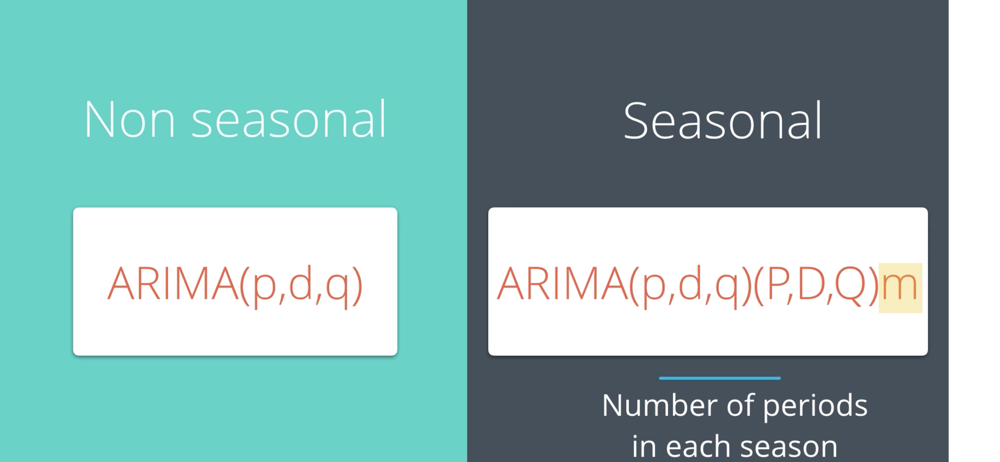

Here, **m** stands for the periods of each season.Upper **(P,D, Q)** stands for autoregressive differencing and moving
average term for the seasonal part of ARIMA model.

## Seasonal Differencing

Seasonal difference in time series is a series of changes from one season to the next, For monthly data M=12 Seasonal
difference will be difference between itself and next season moth, Jan 2015 - Jan 2016 (m=12)
SARIMA and ARIMA ACF and PACF can show similar pattern, but lags are seasons.


## ARIMA Summary

Summary: ARIMA which stands for Autoregressive Integrated Moving Average helps you forecast data for seasonal and
nonseasonal data

### STEP 1: TIME SERIES DECOMPOSITION PLOT

A time series decomposition plot allows you to observe the seasonality, trend, and error/remainder terms of a time
series.

Useful Alteryx tool: TS Plot

### STEP 2: DETERMINE THE ARIMA TERMS

Nonseasonal ARIMA models are displayed in the terms (p,d,q) which stand for
p - periods to lag for,
d - number of transformations used to make the data stationary,
q - lags of the error component

**Stationary** - mean and variance are constant over time vs Non-Stationary - mean and variance change over time

**Differencing** - take the value in the current period and subtract it by the value from the previous period. You might
have to do this several times to make the data stationary. This is the Integrated component which is d in the model
terms.

**Autocorrelation** - How correlated a time series is with its past values, if positive at Lag-1 then AR if negative
then MA

**Partial Autocorrelation** - The correlation between 2 variables controlling for the values of another set of
variables. If
the partial autocorrelation drops of quickly then AR terms, if it slowly decays then MA

**Seasonal ARIMA models** are denoted **(p,d,q)(P,D,Q)m**

These models may require seasonal differencing in addition to non-seasonal differencing. Seasonal differencing is when
you subtract the value from a year previous of the current value.

Useful Alteryx tool: TS Plot

### STEP 3: BUILD AND VALIDATE THE ARIMA MODEL

Build the ARIMA model using the terms determined in step 2. You can use internal and external validation to validate the
quality of the model.

**Internal validation:** Look at in-sample error measures, particularly RMSE (Root-Mean-Square Error) and MASE (Mean
Absolute Scaled Error).

**External validation:** Determine the accuracy measures by comparing the forecasted values with the holdout sample.
This is
especially important for comparing ARIMA models to other types of models, such as ETS.

**Pick the ARIMA model with lowest AIC value. If the AIC values are comparable, use calculated errors to pick one that
minimizes error the most. Many software tools will automate the selection of the model by minimizing AIC.**

Useful Alteryx tools: ARIMA, TS Compare

### STEP 4: FORECAST!

Use the best ARIMA model to forecast for the desired time period. Make sure to add the holdout sample back into the
model. Plot the results along with 80% and 95% confidence intervals.

Useful Alteryx tool: TS Forecast

# Analyzing and Visualizing Forecasting Results

Forecast model should include all features which capture all important properties of the time series

* Patterns of variations in level of trends
* Effects of seasonality
* Removing autocorrelation

Identifiers helps us to choose the right model. Comparing criterias:

* Residual Plots
* Forcasting errors: internal/external validaions
* Akaike information criteria.

### Holdout / Validation Sample:

To validate our forecast model ability to make a good forecast.
A subset of a time series that you withhold and then use to check the accuracy of predictions from your model.
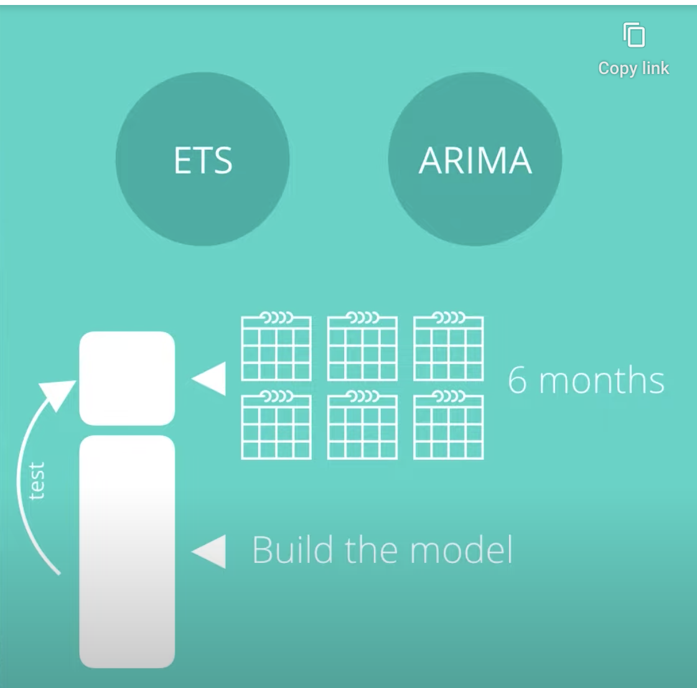

## Residual Plots

Residual forcasting is the difference between and observed value and forecasted value.
A good time series forecasting showed two properties:

* Residual in models are uncorrelated.
  Plotting residual in ACF plot will allow us to see if we have used all of the information in the time series for our
  model.
    * For example : Here there is almost any correlation on any lags. only lag-17
      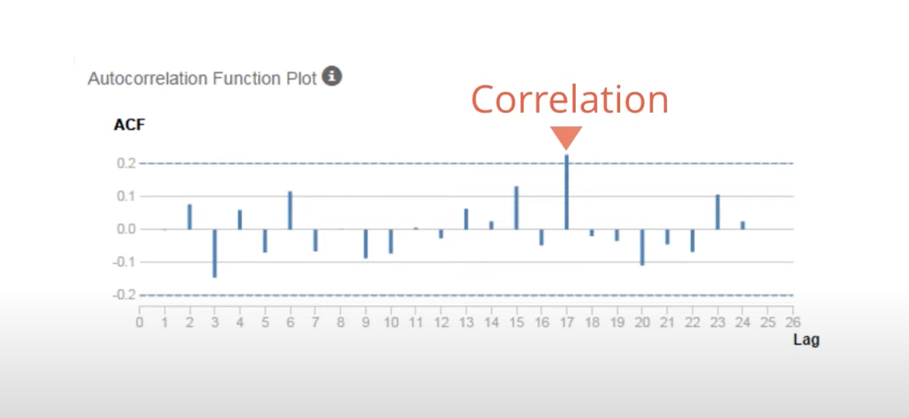
    * Here example there are many strogly correlation in our plot
    * 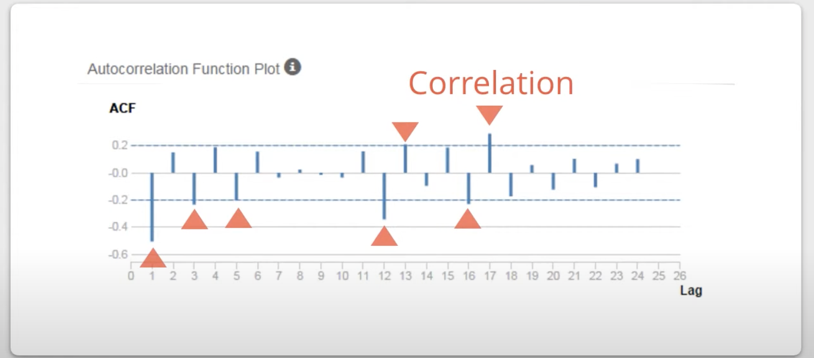
    * We would like to add terms to our model to help adjust for this.
* Residual should have ~0 mean.
    * If residual has other than zero, then forecasts are biased.
        * Adjusting bias is easy: if residual mean is other than zero them simply add mean value to all forecast then
          bias problem solved.
          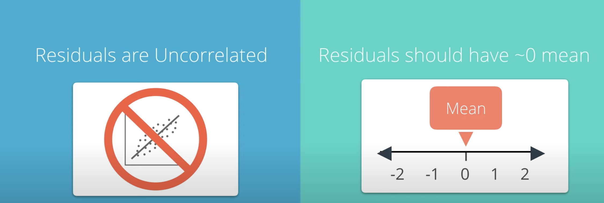
          if forecast residuals that do not contain these characteristics have room for improvements. Adding additional
          terms to our ETS or ARIMA model may alleviate this issue.

## Calculating Errors

[ANOTHER LOOK AT FORECAST-ACCURACY METRICS
FOR INTERMITTENT DEMAND](https://robjhyndman.com/papers/foresight.pdf)

### Scale Dependent Errors

Scale dependent errors, such as mean error (ME) mean percentage error (MPE), mean absolute error (MAE) and root mean
squared error (RMSE), are based on a set scale, which for us is our time series, and cannot be used to make comparisons
that are on a different scale. For example, we wouldn’t take these error values from a time series model of the sheep
population in Scotland and compare it to corn production forecast in the United States.

* Mean Error (ME) shows the average of the difference between actual and forecasted values.
* Mean Percentage Error (MPE) shows the average of the percent difference between actual and forecasted values. Both the
  ME and MPE will help indicate whether the forecasts are biased to be disproportionately positive or negative.
* Root Mean Squared Error (RMSE) represents the sample standard deviation of the differences between predicted values
  and observed values. These individual differences are called residuals when the calculations are performed over the
  data sample that was used for estimation, and are called prediction errors when computed out-of-sample. This is a
  great measurement to use when comparing models as it shows how many deviations from the mean the forecasted values
  fall.
* Mean Absolute Error (MAE) takes the sum of the absolute difference from actual to forecast and averages them. It is
  less sensitive to the occasional very large error because it does not square the errors in the calculation.

### Percentage Errors

Percentage errors, like MAPE, are useful because they are scale independent, so they can be used to compare forecasts
between different data series, unlike scale dependent errors. The disadvantage is that it cannot be used if the series
has zero values.

* Mean Absolute Percentage Error (MAPE) is also often useful for purposes of reporting, because it is expressed in
  generic percentage terms it will make sense even to someone who has no idea what constitutes a "big" error in terms of
  dollars spent or widgets sold.

### Scale-Free Errors

Scale-free errors were introduced more recently to offer a scale-independent measure that doesn't have many of the
problems of other errors like percentage errors.

* Mean Absolute Scaled Error (MASE) is another relative measure of error that is applicable only to time series data. It
  is defined as the mean absolute error of the model divided by the the mean absolute value of the first difference of
  the series. Thus, it measures the relative reduction in error compared to a naive model. Ideally its value will be
  significantly less than 1 but is relative to comparison across other models for the same series. Since this error
  measurement is relative and can be applied across models, it is accepted as one of the best metrics for error
  measurement.