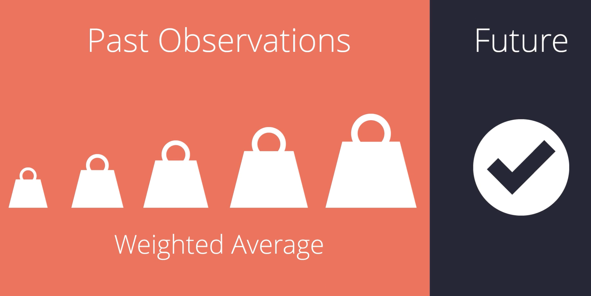
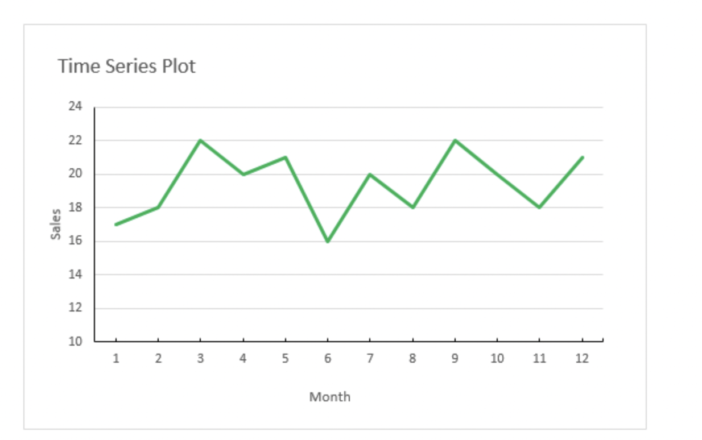

# Time Series Forecasting 

Udacity Course : https://learn.udacity.com/courses/ud980 

{width="6.267716535433071in" height="3.25in"}

# Basics:

## Trend:

{width="6.267716535433071in"
height="2.9722222222222223in"}

## Seasional Plot:

{width="6.267716535433071in"
height="3.736111111111111in"}

{width="6.267716535433071in"
height="3.3194444444444446in"}

Here is a seasonal pattern, which can show that there is a repeated
pattern for the same time ranges.

And also when we look ate magtitudes of ech year sales are getting
bigger, thats mean there is a uptrend of sales.

## Cyclical pattern:

What if we see a pattern in our data , which is not occurred with in the
same calender year? This is cyclical pattern exist when there is a rises
and falls that are not f a fixed period.

{width="6.267716535433071in"
height="5.361111111111111in"}

{width="6.267716535433071in"
height="3.138888888888889in"}

**If fluctuations are not a fixed period then they are cyclical.**

**If the period is unchanging and associated within some aspect of
calender it is seasonal.**

# ETS Model:

## Exponantel Smooting Forcasting Model:

This model uses weighted averagesf past observations and giving more
weight to the most present observation and with weights gradually
getting smaller in the past observations.

{width="6.267716535433071in"
height="3.138888888888889in"}

## ETS:

{width="6.267716535433071in"
height="2.9722222222222223in"}

Each term can apply ither additevely, multiplicaively or in some cases
lefts out of the model all together.

How to apply Error Trend and Sesional terms of an ETS model (Eror Trend
Sesional) it is a way to apply Time Series Decomposition plot.

{width="6.267716535433071in"
height="3.9444444444444446in"}

**Data** shows the actual time series data

**The seasonal** shows that there are a sesipnal patterns e can see in
in Hotel booking example, easonal only occurs regular intervals and th
increasing magnitude

**Trend line** indicates the general corse or tendency of time series.
It is the centered moving erage of the time series and fits between
seasonal aks and valleys. This line concidered desesionalized

**Error**: Difference between observed value and endline estimate. It is
the piece that non accounted for combinening seasonal peace and trend
peace. All time series have the residual errors help explain with trend
and seasonality can not.

Making use of the trend seasonal and error plots shown together Time
series Decomposition Plot.

## Identifying Additive or Multiplicative Terms

{width="6.267716535433071in"
height="3.1805555555555554in"}

behaviour

{width="6.267716535433071in"
height="2.9305555555555554in"}

Selecting additive or Multiplicative behaviour in terms of relies on
analysis's ability to seeend, seasonal and error patterns.

## Time Series Scenarios

Next we\'re going to be exploring several different exponential models
to understand how each model is different and which model should be used
for which specific scenario you\'ll see in a time series. The possible
time series (TS) scenarios can be recognized by asking the following
questions:

-   TS has a trend?

    -   If yes, is the trend increasing linearly or exponentially?

-   TS has seasonality?

    -   If yes, do the seasonal components increase in magnitude over
        > time?

### Scenarios

Therefore the scenarios could be:

-   No-Trend, No-Seasonal

-   No-Trend, Seasonal-Constant

-   No-Trend, Seasonal-Increasing

```{=html}
<!-- -->
```
-   Trend-Linear,No-Seasonal

-   Trend-Linear,Seasonal-Constant

-   Trend-Linear,Seasonal-Increasing

```{=html}
<!-- -->
```
-   Trend-Exponential,No-Seasonal

-   Trend-Exponential,Seasonal-Constant

-   Trend-Exponential,Seasonal-Increasing

As you can see there are nine possible scenarios.

### ETS Models

We are going to explore four ETS models that can help forecast these
possible time-series scenarios.

-   Simple Exponential Smoothing Method

-   Holt\'s Linear Trend Method

-   Exponential Trend Method

-   Holt-Winters Seasonal Method

# Simple Exponential Smoothing

{width="6.267716535433071in"
height="3.9305555555555554in"}

Time series does not have a trend line and does not have seasonality
component. We would use a Simple Exponential Smoothing model.

For simple exponential smoothing methods, the forecast is calculated by
multiplying past values by relative weights, which are calculated based
upon what is termed a smoothing parameter. You'll also hear this called
the alpha or **α**. This is the magnitude of the weight applied to the
previous values, with the weights decreasing exponentially as the
observations get older. The formula looks like this:

Forecast = Weightt Yt + Weightt-1 Yt-1 + Weightt-2 Yt-2 + \... + (1-α)n
Yn

where

**t** is the number of time periods before the most recent period (e.g.
**t** = 0 for the most recent time period, **t** = 1 for the time period
before that).

**Yt** = actual value of the time series in period t

**Weightt** = α(1-α)t

**n** = the total number of time periods

This model basically gives us a smooth line or **LEVEL** in our forecast
that we can use to forecast the next period.

Here are a few key points to help understand the smoothing parameter:

-   The smoothing parameter can be set for *any value between 0 and 1*.

-   If the smoothing parameter is close to one, more recent observations
    > carry more weight or influence over the forecast (if **α** = 0.8,
    > weights are 0.8, 0.16, 0.03, 0.01, etc.).

-   If the smoothing parameter is close to zero, the influence or weight
    > of recent and older observations is more balanced (if **α** = 0.2,
    > weights are 0.2, 0.16, 0.13, 0.10, etc.).

#### **Choosing the Smoothing Parameter α**

Choosing the correct smoothing parameter is often an iterative process.
Luckily, advanced statistical tools, like Alteryx, will select the best
smoothing parameter based upon minimizing forecasting error. Otherwise,
you will need to test many smoothing parameters against each other to
see which model best fits the data.

The advantage of exponential smoothing methods over simple moving
averages is that new data is depreciated at a constant rate, gradually
declining in its impact, whereas the impact of a large or small value in
a moving average, will have a constant impact. However, this also means
that exponential smoothing methods are more sensitive to sudden large or
small values.

The simple exponential smoothing method does not account for any trend
or seasonal components, rather, it only uses the decreasing weights to
forecast future results. This makes the method suitable only for time
series without trend and seasonality.

[[https://otexts.com/fpp2/ses.html]{.underline}](https://otexts.com/fpp2/ses.html)

[[https://www.excel-easy.com/examples/exponential-smoothing.html]{.underline}](https://www.excel-easy.com/examples/exponential-smoothing.html)

# Holt's Linear Trend Method (Double Exponaential Smoothing )

The method builds off of a simple exponential smooting by including not
only the level but oaalso the trend in its calculation.

{width="6.267716535433071in"
height="2.9444444444444446in"}

it calsulates level and trend smoothing calculation. It always applied
in a linear or additive fashion.

Holts linear model is a great model to apply to any non seasonal data
set.

# Exponential Trend Method {width="6.267716535433071in" height="3.138888888888889in"}

A variation of the holts linear tred method is Exponential Trend Method,
it is uses Level and trend components but it multiplies them. This means
trend will de/increase exponential rather that linear and exhibits
forecasts with a trend growth rate by factoring rather than additiona.

{width="6.267716535433071in"
height="3.1666666666666665in"}

# Damped Trend Method

Sometimes our model can over forecast results since the forecast
generated display a constant trend line extrapolating values into the
future.

Damped Trend methods can apply additively and multilicative fashion.

Small phi(𝚽) meand trend line changes overtime is slow. Larger phi means
changing rapidly.

# Holt-Winter Sesional Method

Holtz-Winter Sesional method comprises of forecast equation with 3
snooting equations, Level, Trend and Seasional. We can 2 variations of
applications additive and multiplicative .

{width="6.267716535433071in"
height="3.0694444444444446in"}

Holtz-Winter can also use with a damped parameter, and is one of the
most widely regarded methods for forecasting seasonal data.


